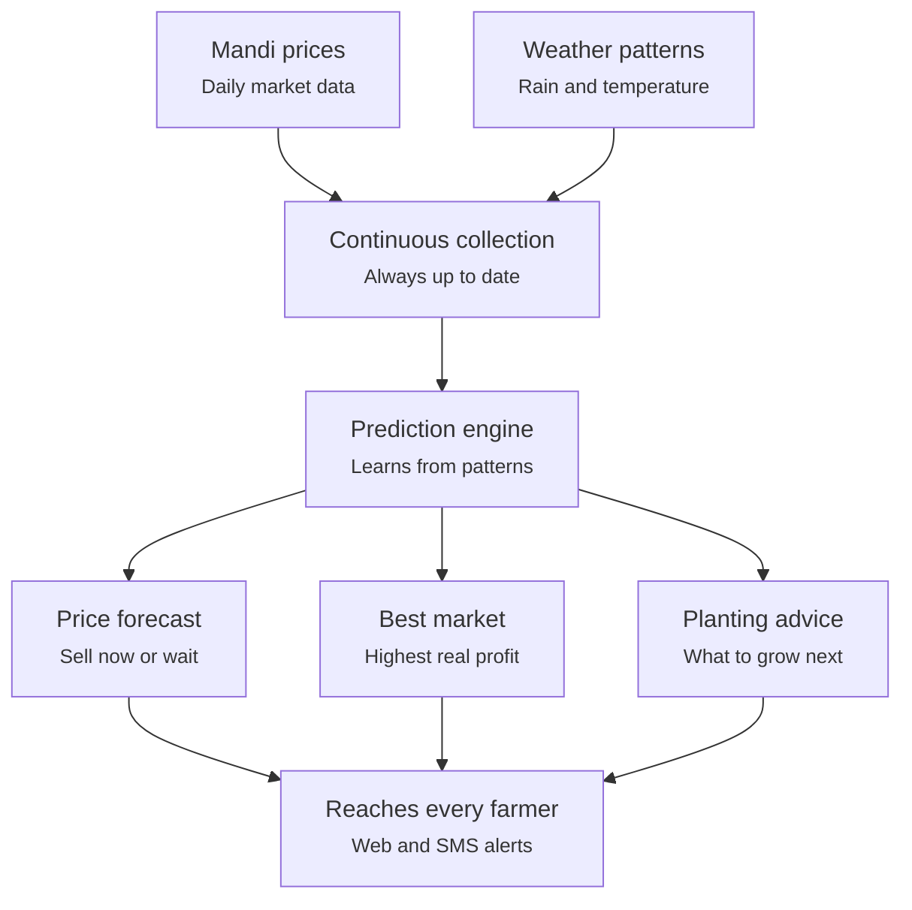

# Fasal Nivesh (फसल निवेश) — "Crop Investment"

Farmers lose real money every season not because they grow the wrong
crop, but because they sell it at the wrong time, in the wrong place,
without knowing any better. Fasal Nivesh closes that information gap.

## What it is

Fasal Nivesh watches real market and weather data continuously and turns
it into three plain answers for a farmer:

- **Sell now, or wait?** — a short-term price forecast for their crop
- **Which market is actually worth the trip?** — nearby markets ranked
  by what they'll really put in the farmer's pocket after transport cost,
  not just the sticker price
- **What should I plant next season?** — an estimate based on how
  weather and prices have historically moved together

## Why it exists

A farmer selling produce today usually knows only the price at the one
market in front of them, on the one day they show up. They don't know
that a market 30km away is paying more this week, or that a forecasted
dry spell means prices are about to rise if they can hold their harvest
a few more days. That single gap in information — not a lack of good
produce — is what quietly erodes a season's income. All of the data
needed to close that gap is already public and free; it's just never
been turned into a straight answer a farmer can act on.

## How it solves the problem

The system never stops watching. Every day, it pulls fresh market prices
and weather data, learns from the patterns building up over time, and
turns that into forecasts and recommendations — delivered in a form that
works even for someone without a smartphone or a data plan.



The core idea is a continuous loop, not a one-time report: today's data
sharpens tomorrow's forecast, and every recommendation is delivered in
the way that reaches a farmer, not just the way that's easiest to build.

## Getting started

### Prerequisites

- Docker + docker-compose
- A free data.gov.in account (no key needed for the weather data)

### 1. Get a free data.gov.in API key

1. Register at https://data.gov.in/user/register — instant, no approval wait
2. Open the mandi price dataset:
   https://www.data.gov.in/catalog/current-daily-price-various-commodities-various-markets-mandi
3. Click **Catalog API** — this page gives you your resource ID and API key

### 2. Configure

```bash
cp .env.example .env
# edit .env — fill in DATA_GOV_API_KEY and DATA_GOV_RESOURCE_ID
```

### 3. Run the infrastructure

```bash
docker-compose up -d zookeeper kafka cassandra redis
```

Wait ~30 seconds for Cassandra to report healthy, then load the schema:

```bash
docker exec -i $(docker ps -qf name=cassandra) cqlsh < cassandra/schema.cql
```

### 4. Run the ingestion service

```bash
docker-compose up --build ingestion-go
```

You should see:

```
fetching mandi prices...
published 100 price records
fetching weather data...
published 7 weather records for Pune
```

### 5. Verify data is flowing

```bash
docker exec -it $(docker ps -qf name=kafka) kafka-console-consumer \
  --bootstrap-server localhost:9092 --topic price.raw --from-beginning --max-messages 5
```

## License

MIT — this is a learning/portfolio project built entirely on public,
open government data.
